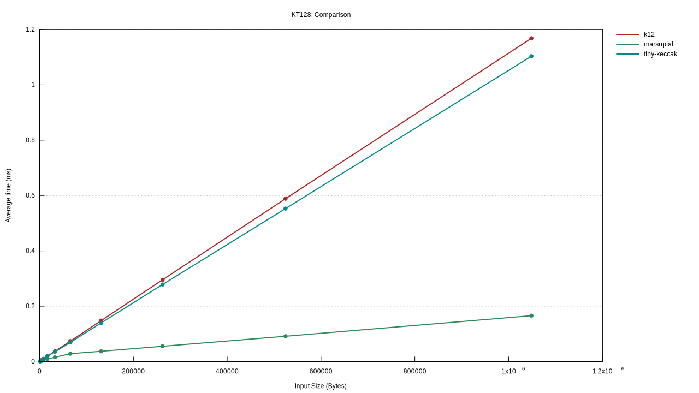
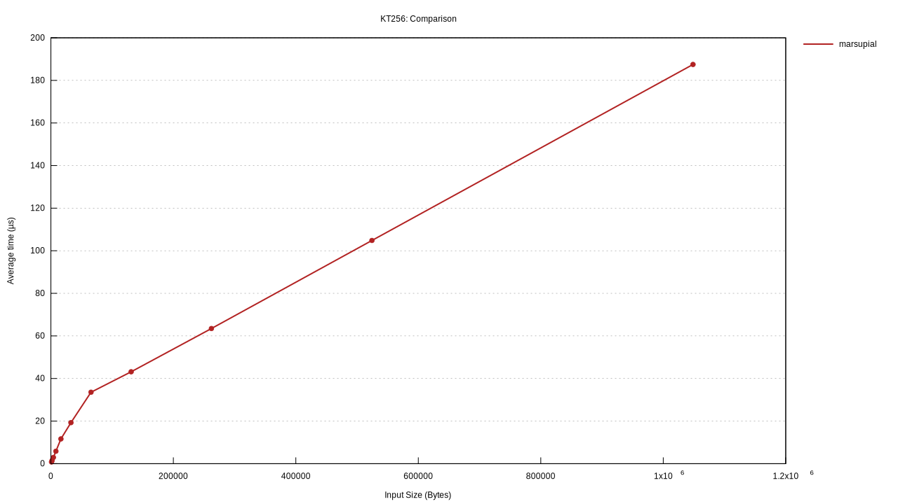

# marsupial

a rust wrapper for [xkcp/k12](https://github.com/XKCP/K12), derived from
[oconnor663/kangarootwelve_xkcp.rs](https://github.com/oconnor663/kangarootwelve_xkcp.rs)

## usage

in order to use the crate, you need:

- a c compiler
- rust
- gnuplot (if you want plot generation when benchmarking)

then, just add a dependency upon the `marsupial` crate in `Cargo.toml`, and
then you can use it like this:

```rust
use marsupial::Hasher;

// hash an input all at once
let hash1 = marsupial::hash(b"foobarbaz");

// hash an input incrementally
let mut hasher = Hasher::new();
hasher.update(b"foo");
hasher.update(b"bar");
hasher.update(b"baz");
let hash2 = hasher.finalize();
assert_eq!(hash1, hash2);

// extended output. `OutputReader` also implements `Read`
let mut hasher = Hasher::new();
hasher.update(b"foobarbaz");
let mut output_reader = hasher.finalize_xof();
let mut output = [0; 1000];
output_reader.squeeze(&mut output);
assert_eq!(&output[..32], hash1.as_bytes());

// emit the hash as hexadecimal
println!("{}", hash1.to_hex());
```

## is it fast?

benchmarks done on an intel i5-1135G7 using rust 1.79.0 on debian linux trixie/sid





## license

as is with `kangarootwelve_xkcp.rs`, all of the rust wrapping code is dedicated
to the public domain via
[cc0](https://creativecommons.org/publicdomain/zero/1.0/). the vendored
[xkcp](https://github.com/XKCP/XKCP) code is covered by a
[mixture of licenses](https://github.com/XKCP/XKCP#under-which-license-is-the-xkcp-distributed)
